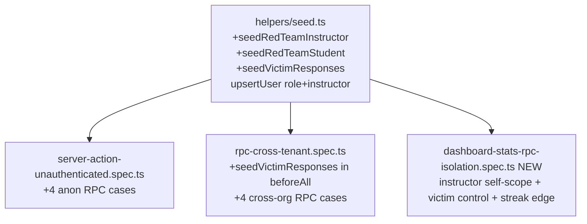

# Design Document

## Overview

Add red-team Playwright regression coverage for the four #668 student aggregation RPCs
(`get_student_mastery_stats`, `get_question_counts`, `get_student_streak`,
`get_student_last_practiced`). The change is **tests + test fixtures only** — no production
code, no migrations. It extends two existing red-team specs (unauthenticated, cross-tenant)
and adds one new spec (instructor self-scope + victim positive control + streak edge
correctness), backed by three new seed helpers in the existing red-team seed module.

The design's central requirement is **non-vacuity**: the negative isolation assertions
(anon/cross-org/instructor see nothing) are only meaningful because the egmont victim is
seeded with real response data — so an empty result proves isolation, not absence-of-data.

## Steering Document Alignment

### Technical Standards (tech.md)
- Tests are Playwright specs under the existing `redteam` project (`workers:1`, sequential),
  invoked by `pnpm --filter @repo/web e2e:redteam`. No new project/config wiring.
- Supabase access uses the established two-client pattern: anon-key `createClient` for
  unauthenticated/role-authenticated callers (`createAuthenticatedClient`) and the
  service-role `getAdminClient()` for seeding (test infra only, never shipped).
- Security alignment: the instructor self-scope assertions pin `docs/security.md` §11
  ("Multiple Permissive RLS SELECT Policies") — the `sr.student_id = auth.uid()` predicate
  in the two `student_responses` RPCs. Seeded `student_responses` honour the immutable /
  append-only rule (`docs/security.md` §6): inserted once, never updated or deleted.

### Project Structure (structure.md)
- New spec file co-located with siblings in `apps/web/e2e/redteam/`.
- Seed logic lives in `apps/web/e2e/redteam/helpers/seed.ts` alongside the existing
  `seedRedTeamUsers` / `seedRedTeamAdmin` / `pickSubjectWithQuestions` helpers.
- Test names describe externally observable behaviour (code-style.md §7).

## Code Reuse Analysis

### Existing Components to Leverage
- **`seedRedTeamUsers()`** (`helpers/seed.ts:20`): provisions egmont org + attacker/victim students; returns `{ victimUserId, orgId, ... }`. Reused to obtain the victim id + egmont orgId.
- **`createCrossOrgUser()`** (`seed.ts:67`): cross-org student (no responses). Already used by `rpc-cross-tenant.spec.ts`.
- **`seedRedTeamAdmin()`** (`seed.ts:107`): the template for the new `seedRedTeamInstructor()`.
- **`createAuthenticatedClient(email, password)`** (`helpers/redteam-client.ts:11`): email/password sign-in → JWT client. Reused to auth as victim + instructor.
- **`getAdminClient()`** (`../helpers/supabase.ts:25`): service-role client for seeding.
- **`pickSubjectWithQuestions(admin, {orgId})`** (`seed.ts:182`): deterministic subject/topic with ≥1 active question — reused to source the questions for the victim's responses.

### Integration Points
- **`apps/web/e2e/redteam/server-action-unauthenticated.spec.ts`**: extend the existing describe with 4 anon RPC cases.
- **`apps/web/e2e/redteam/rpc-cross-tenant.spec.ts`**: extend the existing describe's `beforeAll` (call `seedVictimResponses`) and add 4 cross-org RPC cases.
- **`student_responses` table**: seed via `admin.from('student_responses').insert([...])` (service role bypasses RLS; INSERT is the allowed append-only op — there is no `WITH CHECK (false)` direct-insert block on this table, unlike `audit_events`).

## Architecture

Three test files + one helper module change. No runtime/production code.



### Modular Design Principles
- **Single responsibility:** seeding (data setup) in `seed.ts`; assertions in specs.
- **No duplication:** all client/auth/seed plumbing is reused, not re-implemented.
- **Isolation:** the new spec owns only the instructor/victim/streak assertions; anon and cross-org cases stay in their topical existing specs (matching the red-team file taxonomy).

## Components and Interfaces

### Component 1 — `seed.ts`: role widening
- **Change:** `upsertUser(admin, email, password, orgId, role: 'student' | 'admin' | 'instructor' = 'student')`.
- **Why:** the DB CHECK already allows `('admin','instructor','student')`; only the TS union was narrower.
- **Reuses:** the entire existing `upsertUser` body unchanged otherwise.

### Component 2 — `seedRedTeamInstructor()`
- **Purpose:** ensure an egmont **instructor** with zero responses exists.
- **Interface:** `() => Promise<{ instructorUserId: string; orgId: string; email: string; password: string }>`.
- **Implementation:** mirror `seedRedTeamAdmin` exactly, with new module-private consts `INSTRUCTOR_EMAIL = 'redteam-instructor@lmsplus.local'`, `INSTRUCTOR_PASSWORD = 'redteam-instructor-2026!'`, calling `upsertUser(..., 'instructor')`.
- **Dependencies:** `getAdminClient`, `upsertUser`. **Reuses:** `seedRedTeamAdmin` shape.

### Component 3 — `seedRedTeamStudent()`
- **Purpose:** expose the egmont **victim** student credentials for sign-in.
- **Interface:** `() => Promise<{ victimUserId: string; orgId: string; email: string; password: string }>`.
- **Implementation:** resolve egmont org, `upsertUser(VICTIM_EMAIL, VICTIM_PASSWORD, orgId)` (idempotent), return creds. (`VICTIM_EMAIL/PASSWORD` are already module consts.)

### Component 4 — `seedVictimResponses()`
- **Purpose:** insert a deterministic, idempotent set of the victim's `student_responses` so the isolation tests are non-vacuous and the streak edge case is exact.
- **Interface:**
  ```ts
  type VictimResponseFixture = {
    victimUserId: string
    correctCount: number          // distinct questions seeded (8 when >=8 available; fewer on a small seed)
    subjectIds: string[]          // distinct subjects covered (>= 1)
    questionIds: string[]         // the 8 seeded rows' question ids (round-robin; may repeat if <8 questions)
    expected: { current: 3; best: 5 }
  }
  seedVictimResponses(): Promise<VictimResponseFixture>
  ```
- **Algorithm:**
  1. `const { victimUserId, orgId } = await seedRedTeamStudent()`.
  2. **Idempotency guard:** `SELECT count(*) FROM student_responses WHERE student_id = victim AND response_time_ms = SENTINEL` (`SENTINEL = 987654`). If `(count ?? 0) >= 8`, skip the insert (re-derive `subjectIds` from the existing sentinel rows joined to `questions`, then return). **`>= 8`, not `=== 8`:** a partial-then-full prior run can leave 9–15 sentinel rows, and a strict `=== 8` would miss that state and insert again, accumulating unboundedly.
  3. Select **up to 8 distinct active, non-deleted egmont questions** (`SELECT id, subject_id FROM questions WHERE organization_id = orgId AND status='active' AND deleted_at IS NULL ORDER BY id LIMIT 8`). Require **≥1** (throw only if zero — egmont always has active questions; existing specs depend on it). **Dates are decoupled from questions** (plan-critic CRITICAL-3): the streak needs 8 distinct *dates*, not 8 distinct questions.
  4. **Date math from a single snapshot:** capture `const now = new Date()` once; `base = Date.UTC(now.getUTCFullYear(), now.getUTCMonth(), now.getUTCDate(), 12, 0, 0)`; offsets `[0,1,2, 6,7,8,9,10]` (current run today/−1/−2 → 3; best run −6..−10 → 5; 3-day gap −3/−4/−5 keeps them separate). `created_at[i] = new Date(base - offsets[i]*86_400_000).toISOString()`.
  5. Build **8 rows — one per date** — assigning a question **round-robin** over the available questions (`question = questions[i % questions.length]`), so a seed with <8 questions still yields 8 distinct dates: `{ organization_id: orgId, student_id: victimUserId, question_id, selected_option_id: 'a', is_correct: true, response_time_ms: SENTINEL, session_id: null, created_at }`. Insert in a single `.insert([...])`; destructure `{ error }` and throw on error.
  6. Return the fixture (`subjectIds` = distinct subjects of the chosen questions, ≥1; `expected = {current:3,best:5}`).
- **RPC trusts `sr.is_correct`:** `get_student_mastery_stats` reads `sr.is_correct` directly (it does NOT re-derive correctness from `selected_option_id` vs the question's correct option), so `is_correct: true` is sufficient and `selected_option_id: 'a'` is cosmetic. Do not "fix" the seed to compute a real per-question option. _(plan-critic SUGGESTION-1)_
- **Idempotency robustness:** the guard skips at **≥ 8** sentinel rows. A partial prior run (count 1–7) cannot be cleaned (append-only), so a re-run inserts a fresh 8 (total now ≥ 8, so every later run short-circuits); the resulting duplicate (student, question, date) rows are **harmless** because every consuming RPC collapses them: streak uses `SELECT DISTINCT` dates, mastery uses `COUNT(DISTINCT sr.question_id)`, last-practiced is `MAX(created_at) GROUP BY subject_id`. The `UNIQUE(session_id, question_id)` constraint does not fire because `session_id IS NULL` (Postgres treats NULLs as distinct). The asserted values (current=3, best=5, correct>0, ≥1 subject) are therefore invariant to duplication. _(plan-critic confirmed duplicate-tolerance for all three RPCs)_
- **Dependencies:** `getAdminClient`, `seedRedTeamStudent`. **Reuses:** existing admin query patterns + `{ error }` discipline (code-style §5). (A direct `questions` query is used rather than `pickSubjectWithQuestions`, since we want up-to-8 questions, not one subject/topic.)

### Component 5 — `server-action-unauthenticated.spec.ts` (extend)
- Add 4 tests using the existing `unauthClient`:
  - mastery → `error===null && Array.isArray(data) && data.length===0`.
  - `get_question_counts` `{ p_status: 'active' }` → `error===null && data.length===0`.
  - last-practiced → `error===null && data.length===0`.
  - streak → `error===null && data.length===1 && data[0].current_streak===0 && data[0].best_streak===0`.
- No victim seeding needed (anon empties are correct regardless); no cleanup (read-only).

### Component 6 — `rpc-cross-tenant.spec.ts` (extend)
- In the existing `beforeAll`, add `await seedVictimResponses()` (so the differential holds).
- Add 4 tests using the existing `crossOrgClient`:
  - mastery → no row with `correct > 0` (`(data ?? []).every(r => r.correct === 0)`); empty is acceptable.
  - `get_question_counts` `{ p_status: 'active' }` → `data.length===0` (other-org has no questions).
  - last-practiced → `data.length===0`.
  - streak → single `{0,0}` row.
- No new cleanup (read-only RPC calls; existing `afterAll` for the BY-vector fixture rows is untouched).

### Component 7 — `dashboard-stats-rpc-isolation.spec.ts` (NEW)
- **Header comment** documents: vectors BW3/BX3/BX4/BX7 + positive control; the persistent-seed/no-cleanup rationale (append-only `student_responses`).
- **`beforeAll`:** `seedRedTeamUsers()`, `seedRedTeamInstructor()`, `const fixture = await seedVictimResponses()`; `victimClient = createAuthenticatedClient(VICTIM creds)`, `instructorClient = createAuthenticatedClient(instructor creds)`. (Export `seedRedTeamStudent`/instructor creds via their return values.)
- **Tests:**
  - instructor mastery → `(data ?? []).every(r => r.correct === 0)` AND `data.length > 0`. **Verified load-bearing fact (plan-critic CRITICAL-2):** `get_student_mastery_stats` resolves org via `caller AS (SELECT organization_id FROM users WHERE id = auth.uid() AND deleted_at IS NULL)` — **no `role='student'` filter** — and the result is driven by `subject_totals`/`topic_totals` (caller-independent denominator) `LEFT JOIN` the self-scoped numerator. So an egmont instructor gets denominator rows with `correct = COALESCE(NULL,0) = 0`. The `data.length > 0` assertion depends on (a) the instructor being in egmont and (b) egmont having active questions — both guaranteed by the seed. _(BW3)_
  - instructor streak → single `{0,0}`. _(BX3)_
  - instructor last-practiced → `data.length===0`. _(BX4)_
  - victim mastery → `(data ?? []).some(r => r.correct > 0)`. _(positive control)_
  - victim last-practiced → `data.length >= 1`. _(positive control)_
  - victim streak → `data[0].current_streak===3 && data[0].best_streak===5`. _(BX7)_

## Data Models

### VictimResponseFixture (returned by `seedVictimResponses`)
```
- victimUserId: uuid
- correctCount: number (8)
- subjectIds: uuid[]   (distinct, >=1)
- questionIds: uuid[]  (8 distinct)
- expected: { current: 3, best: 5 }
```

### Seeded student_responses row (×8 — one per distinct date)
```
- organization_id: uuid (egmont)   NOT NULL
- student_id: uuid (victim)        NOT NULL
- question_id: uuid                NOT NULL (up to 8 distinct active egmont questions,
                                    reused round-robin if the seed has fewer than 8;
                                    >=1 distinct question guaranteed)
- selected_option_id: 'a'         TEXT NOT NULL CHECK IN ('a','b','c','d') (cosmetic;
                                    RPC trusts is_correct, not this value)
- is_correct: true                 NOT NULL
- response_time_ms: 987654         INT NOT NULL (idempotency sentinel)
- session_id: null                 nullable (keeps UNIQUE(session_id,question_id) inert)
- created_at: noon-UTC backdated   8 DISTINCT dates, offsets [0,1,2,6,7,8,9,10] days
```

## Error Handling

### Error Scenarios
1. **Zero active egmont questions available** (a regressed/empty seed)
   - **Handling:** `seedVictimResponses` throws a descriptive error ("need ≥1 active egmont question, found 0"). With ≥1 question the 8 dates are seeded via round-robin, so the helper does NOT depend on the seed having ≥8 questions.
   - **Impact:** the spec fails loudly in `beforeAll` rather than silently asserting on a degenerate fixture. (Egmont always has active questions — existing `rpc-cross-tenant` / `pickSubjectWithQuestions` specs already rely on this.)
2. **Insert error on `student_responses`** (FK/CHECK violation, RLS surprise)
   - **Handling:** destructure `{ error }`, `throw new Error('seedVictimResponses insert: ' + error.message)`.
   - **Impact:** loud failure; no partial silent state beyond the harmless-duplicate case above.
3. **Auth failure for instructor/victim sign-in**
   - **Handling:** `createAuthenticatedClient` already throws on sign-in error.
4. **Streak assertion off-by-one at a UTC-midnight rollover**
   - **Handling:** single captured snapshot + 3-day gap keep both runs shifting together (lengths 3/5 preserved; current run still ends today-or-yesterday). Documented in the seed helper.

## Testing Strategy

### Unit Testing
- No new unit tests for the RPCs (unchanged). If `seed.ts` grows a non-trivial helper that warrants it, a co-located `helpers/seed.test.ts` already exists and can be extended — but `seedVictimResponses` is integration-only (hits the DB) and is exercised by the specs themselves, so a Vitest unit test is not added (it would only test mocks).

### Integration / E2E Testing
- The four RPCs are exercised end-to-end through supabase-js as four distinct callers (anon, cross-org student, instructor, victim) against the local Supabase stack.
- **Run:** `pnpm --filter @repo/web e2e:redteam`. Requires local Supabase (`:54321`) + dev server (`:3000`); Playwright auto-starts the dev server, local Supabase must be up (`npx --no-install supabase start`).
- **Fallback:** if the local stack cannot be brought up in this environment, CI's **Red Team** workflow runs the same project on the PR as the gate. Either path must be green before merge.

### Coverage of the issue's acceptance (#673)
- anon: 4 RPCs (Req 1) — in `server-action-unauthenticated.spec.ts`.
- cross-org: 4 RPCs (Req 2) — in `rpc-cross-tenant.spec.ts`.
- instructor zero-response self-scope: mastery/streak/last-practiced (Req 3) + victim positive control (Req 4.1–4.2) — new spec.
- streak gaps-and-islands edge (Req 4.3 / BX7) — new spec.

### Out of scope (tracked elsewhere)
- `get_admin_dashboard_students` admin-RPC vectors (BY1/BZ1) → issue #685.
- `get_random_question_ids` / `get_filtered_question_counts` (CA/CB of mig 20260528000001) → separate from #673's four RPCs.
