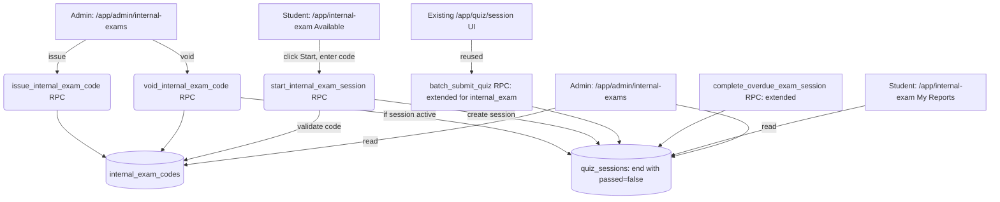

# Design Document — Internal Exam Mode

## Overview

Internal Exam Mode adds a fourth value `'internal_exam'` to `quiz_sessions.mode`, alongside the existing `smart_review`, `quick_quiz`, `mock_exam`. It introduces one new table (`internal_exam_codes`), three new RPCs (`issue_internal_exam_code`, `start_internal_exam_session`, `void_internal_exam_code`), and extends two existing RPCs (`batch_submit_quiz`, `complete_overdue_exam_session`) to recognize the new mode.

The student-facing UI clones the existing exam-session components 1:1 (timer, answer buffer, results card) by passing the new mode through unchanged. Only the badge label, the entry path (code-entry modal vs. quiz-config form), and the discard-button visibility differ. A new top-level nav item "Internal Exam" routes to a two-tab page (`Available` + `My Reports`). The admin gets a sibling `/app/admin/internal-exams` page with code-issuance + voiding + monitoring.

Reports separation: the existing `/app/reports` query gains a `.neq('mode', 'internal_exam')` filter; internal-exam reports live exclusively under the new student tab and the admin page.

## Steering Document Alignment

### Technical Standards (`tech.md`)

- All mutations via Server Actions; no API route handlers.
- Every new RPC: `SECURITY DEFINER` + `auth.uid()` check + `SET search_path = public` + `deleted_at IS NULL` filters on every user / session / subject / exam_config lookup, including audit-event INSERT subqueries (`security.md` rule 10).
- `mode='internal_exam'` is added to `quiz_sessions.mode` CHECK via a single forward migration (no edits to existing migration files).
- Each new RPC migration ≤ 300 SQL lines; split if approaching the limit.
- TypeScript strict, no `any`, Zod parse on every Server Action input.

### Project Structure (`structure.md`)

- New student route: `apps/web/app/app/internal-exam/` with co-located `_components/`, `_hooks/`, `actions/`.
- New admin route: `apps/web/app/app/admin/internal-exams/` with the same sub-structure.
- New constants module: `apps/web/lib/constants/exam-modes.ts` (centralizes `MODE_LABELS`, closes #544).
- New migrations: `057_*` → `06x_*`, both timestamped (in `supabase/migrations/`) and numbered (in `packages/db/migrations/`).
- Tests co-located.

## Code Reuse Analysis

### Existing Components to Leverage (REUSE — no edit)

| File | How |
|---|---|
| `apps/web/app/app/quiz/_components/exam-countdown-timer.tsx` | Mode-agnostic; passed `timeLimitSeconds`, `startedAt`, `onExpired`. |
| `apps/web/app/app/quiz/session/_components/quiz-session.tsx` | Already accepts `mode`; pass `'internal_exam'`. |
| `apps/web/app/app/quiz/session/_components/quiz-session-loader.tsx` | Async bootstrap unchanged. |
| `apps/web/app/app/quiz/session/_components/quiz-session-header.tsx` | Already takes `isExam` boolean. |
| `apps/web/app/app/quiz/session/_hooks/use-exam-state.ts` | Already mode-aware. |
| `apps/web/app/app/quiz/session/_hooks/use-exam-answer-buffer.ts` | Mode-agnostic for exam family. |
| `apps/web/app/app/quiz/_hooks/use-auto-submit-countdown.ts`, `use-quiz-recovery.ts`, `use-session-bootstrap.ts` | Reused as-is. |
| `apps/web/app/app/quiz/report/_components/report-card.tsx`, `result-summary.tsx` | Used by the student internal-exam report page; the only mode-specific bit is the badge label, sourced from `MODE_LABELS`. |

### Components to Extend in Place (EXTEND — small mode-aware change)

| File | Change |
|---|---|
| `apps/web/app/app/quiz/session/_components/exam-session-header.tsx` | Replace hardcoded `"PRACTICE EXAM"` with `MODE_LABELS[mode].toUpperCase()`. |
| `apps/web/app/app/quiz/actions/discard.ts` | Reject when session `mode = 'internal_exam'` with `error: 'cannot_discard_internal_exam'`. |
| ~~`apps/web/app/app/quiz/actions/get-active-exam-session.ts`~~ | **Do NOT widen.** Forked into a new `getActiveInternalExamSession()` instead — see Architecture. |
| `apps/web/app/app/reports/...` (whichever query lists session reports) | Add `.neq('mode', 'internal_exam')` to exclude internal attempts from practice/quiz reports. |
| `apps/web/app/app/_components/nav-items.ts` | Add new top-level student item `Internal Exam` and admin item `Internal Exams`. |

### RPCs to Extend in Place (latest revisions only — `CREATE OR REPLACE` in a new migration)

| RPC | Latest migration | Change |
|---|---|---|
| `batch_submit_quiz` | `056_fix_batch_submit_audit_actor_role_softdelete.sql` | Add `internal_exam` to mode-comparison branches. **Crucial difference vs `mock_exam`:** do NOT enforce the all-questions-answered guard for `internal_exam`. Compute `passed` from `pass_mark` for both `mock_exam` and `internal_exam`. Audit event_type for `internal_exam` is `'internal_exam.completed'`. |
| `complete_overdue_exam_session` | `052_align_overdue_threshold_grace.sql` (latest revision; 054 only touches `start_exam_session`) | Widen mode filter from `mode = 'mock_exam'` to `mode IN ('mock_exam', 'internal_exam')`. Audit event_type uses `internal_exam.expired` when applicable. |
| `complete_empty_exam_session` | `055_align_complete_empty_audit_metadata.sql` | Same widening. (For internal exam, this only fires if zero answers + timeout — equivalent to overdue with empty buffer.) |
| `is_admin()` | `031_admin_rls_easa_tables.sql` | **Add `AND deleted_at IS NULL` to the users lookup.** Currently soft-deleted admins still pass `is_admin()` (security gap caught in plan-critic). New migration `057a` extends the function before the new admin RPCs land. |

### Integration Points

- **`exam_configs` table:** reused unchanged. Internal exam draws `total_questions`, `time_limit_seconds`, `pass_mark`, and the topic distribution from the same row that practice exam uses. Issuance blocks if no enabled config exists for the subject.
- **`quiz_sessions` table:** reused unchanged except for the CHECK extension on `mode`. Internal exam sessions populate the same `config jsonb` shape (`{question_ids, exam_config_id, pass_mark}`).
- **`audit_events`:** new event types only; no schema change.

## Architecture

### Modular Design Principles

- **Single File Responsibility:** one RPC per migration file (issuance / start / void), each ≤ 300 lines.
- **Component Isolation:** student internal-exam page is composition only (≤ 80 lines); tabs are separate component files.
- **Service Layer Separation:** code generation lives in the RPC (atomic with insert); the Server Action is a thin Zod-parsed wrapper.
- **Utility Modularity:** `MODE_LABELS` constant + a tiny helper `isExamMode(mode): boolean` that returns true for `mock_exam` and `internal_exam`.



### Reuse vs. fork decision for `get-active-exam-session.ts`

The existing `getActiveExamSession()` (`apps/web/app/app/quiz/actions/get-active-exam-session.ts`) returns sessions for the practice-exam recovery banner and **does not include `mode` in its return shape**. Widening its mode filter would mix internal-exam sessions into the practice recovery banner with practice-exam copy.

Decision: **FORK** into `getActiveInternalExamSession()` under `apps/web/app/app/internal-exam/actions/`. Reuse the `_overdue-helpers` module unchanged. The forked function differs only in (a) `.eq('mode', 'internal_exam')` and (b) calls `complete_overdue_exam_session` for the same RPC since that RPC is widened to support both modes (migration 063). This keeps the practice recovery banner clean and lets the internal-exam page own its own recovery UI.

### Code generation algorithm

```
charset = 'ABCDEFGHJKLMNPQRSTUVWXYZ23456789'   -- 32 chars, excludes 0,O,I,1
attempt 1..5:
  code = 8 random chars from charset
  try INSERT into internal_exam_codes
  if unique violation -> retry
  else -> return code
exhausted -> raise 'code_generation_failed'
```

Run inside the RPC. Collision probability per attempt ≈ active_codes / 32^8 (negligible).

## Components and Interfaces

### Migration: `057_internal_exam_codes.sql`
- Create `internal_exam_codes` table (columns per Data Models section).
- Indexes: `(student_id) WHERE consumed_at IS NULL AND voided_at IS NULL AND deleted_at IS NULL`; UNIQUE on `code` (case-sensitive).
- RLS: enable. Student SELECT policy `student_id = auth.uid() AND consumed_at IS NULL AND voided_at IS NULL AND expires_at > now() AND deleted_at IS NULL`. Admin SELECT/INSERT/UPDATE/DELETE policies scoped to `organization_id` via `is_admin()`. (Practical writes go through SECURITY DEFINER RPCs — admin policies cover ad-hoc admin tooling and the void path.)

### Migration: `058_extend_quiz_sessions_mode_check.sql`
The mode CHECK in `001_initial_schema.sql:185` was declared **inline** without an explicit name, so the auto-generated constraint name varies by Postgres version. Use a `DO $$` block to look up the actual name and drop it:

```sql
DO $$
DECLARE
  v_constraint_name text;
BEGIN
  SELECT conname INTO v_constraint_name
  FROM pg_constraint
  WHERE conrelid = 'public.quiz_sessions'::regclass
    AND contype = 'c'
    AND pg_get_constraintdef(oid) ILIKE '%mode%mock_exam%';
  IF v_constraint_name IS NULL THEN
    RAISE EXCEPTION 'Could not locate mode CHECK constraint on quiz_sessions';
  END IF;
  EXECUTE format('ALTER TABLE public.quiz_sessions DROP CONSTRAINT %I', v_constraint_name);
END $$;

ALTER TABLE public.quiz_sessions
  ADD CONSTRAINT quiz_sessions_mode_check
  CHECK (mode IN ('smart_review', 'quick_quiz', 'mock_exam', 'internal_exam'));
```

The new constraint is given an explicit name so future migrations have a stable handle.

### Migration: `059_issue_internal_exam_code_rpc.sql`
- `issue_internal_exam_code(p_subject_id uuid, p_student_id uuid) RETURNS TABLE(code_id uuid, code text, expires_at timestamptz)`
- SECURITY DEFINER, SET search_path = public.
- Auth: `auth.uid()` not null + `is_admin()` true (with `deleted_at IS NULL` on the admin user lookup).
- Scope: `p_student_id` must belong to caller's org and be a non-deleted student (role check).
- Pre-req: an enabled non-deleted `exam_configs` row for `(org, p_subject_id)` exists.
- Generates 8-char code (charset above), retries up to 5x on unique violation.
- INSERTs into `internal_exam_codes` with `expires_at = now() + interval '24 hours'`, `issued_by = auth.uid()`.
- Audit: `internal_exam.code_issued` with full subquery deleted_at filters.

### Migration: `060_start_internal_exam_session_rpc.sql`
- `start_internal_exam_session(p_code text) RETURNS TABLE(session_id, question_ids[], time_limit_seconds, total_questions, pass_mark, started_at)`
- SECURITY DEFINER.
- Validates code (errors as enumerated in Requirement 2.4).
- Auto-completes any existing overdue same-subject session for this student first (mirroring `start_exam_session` behavior).
- Builds `question_ids` per the subject's `exam_config_distributions` (same logic as `start_exam_session` — extract that select into a helper if duplicated 2x).
- INSERTs `quiz_sessions` with `mode='internal_exam'`, `time_limit_seconds`, `config = {question_ids, exam_config_id, pass_mark}`, `started_at = now()`.
- UPDATEs `internal_exam_codes` SET `consumed_at = now()`, `consumed_session_id = new id` WHERE id = code AND consumed_at IS NULL (race-safe via WHERE clause).
- Audit: `internal_exam.started`.

### Migration: `061_void_internal_exam_code_rpc.sql`
- `void_internal_exam_code(p_code_id uuid, p_reason text) RETURNS TABLE(code_id uuid, session_id uuid, session_ended boolean)`
- Admin only. Checks code state:
  - Unconsumed → just void (UPDATE `voided_at`/`voided_by`/`void_reason`).
  - Consumed + session active (`ended_at IS NULL`) → void code AND end session: compute score from existing `quiz_session_answers` (treat unanswered as wrong), set `passed = false` (force fail per requirement 4.2 — admin override fails the attempt regardless of score), `ended_at = now()`. Emit `internal_exam.expired` for the session, `internal_exam.code_voided` for the code.
  - Consumed + session ended → raise `cannot_void_finished_attempt`.

### Migration: `062_extend_batch_submit_for_internal_exam.sql`
- `CREATE OR REPLACE FUNCTION batch_submit_quiz(...)` — copy latest body from `056`, adjust:
  - All-answered guard: only when `v_mode = 'mock_exam'` (NOT `internal_exam`). Internal exam allows partial submissions.
  - Pass computation: when `v_mode IN ('mock_exam', 'internal_exam')`, compute `v_passed`. (Was previously only `mock_exam`.)
  - Audit event_type: `'mock_exam' → 'exam.completed'`, `'internal_exam' → 'internal_exam.completed'`, else `'quiz_session.batch_submitted'`.

### Migration: `063_extend_overdue_completion_for_internal_exam.sql`
- `CREATE OR REPLACE FUNCTION complete_overdue_exam_session(...)` — copy latest body from `054`, change `mode = 'mock_exam'` → `mode IN ('mock_exam', 'internal_exam')`. Audit event_type branches the same way.
- Same change for `complete_empty_exam_session` (latest `055`) — included in this migration if line budget permits, else split into `064`.

### Server Actions

- `apps/web/app/app/admin/internal-exams/actions/issue-code.ts` — Zod parse `{ studentId, subjectId }`, `requireAdmin()`, call `issue_internal_exam_code` RPC, return `{ codeId, code, expiresAt }`. Logs error sanitized.
- `apps/web/app/app/admin/internal-exams/actions/void-code.ts` — Zod parse `{ codeId, reason }`, `requireAdmin()`, call `void_internal_exam_code` RPC.
- `apps/web/app/app/admin/internal-exams/queries.ts` — list issued codes (filterable), list internal-exam sessions across org.
- `apps/web/app/app/internal-exam/actions/start-internal-exam.ts` — Zod parse `{ code }`, call `start_internal_exam_session` RPC, return session_id + redirect URL.
- `apps/web/app/app/internal-exam/queries.ts` — list available codes for `auth.uid()` (returns subject + expiry, never the code value itself), list student's internal-exam history.

### Pages and Components

- **Student** `/app/internal-exam/page.tsx` (≤ 80 lines): tabs scaffold, queries the two lists.
  - `_components/available-tab.tsx`: list of available exams + start button → opens `_components/code-entry-modal.tsx`.
  - `_components/my-reports-tab.tsx`: list of past attempts, links to existing report page (`/app/quiz/report?id=...`).
  - `_components/code-entry-modal.tsx`: form with code input, calls `startInternalExam` action, redirects on success.

- **Admin** `/app/admin/internal-exams/page.tsx` (≤ 80 lines): tabs (Codes / Attempts).
  - `_components/issue-code-form.tsx`: student picker + subject picker → submit → display generated code in a copy-to-clipboard panel.
  - `_components/codes-table.tsx`: filterable list with status badges and void action.
  - `_components/void-code-dialog.tsx`: reason input + confirm.
  - `_components/attempts-table.tsx`: completed internal-exam sessions, drilldown to existing report page.

### Constant module

- `apps/web/lib/constants/exam-modes.ts`:
  ```ts
  export const MODE_LABELS = {
    smart_review: 'Smart Review',
    quick_quiz: 'Quick Quiz',
    mock_exam: 'Practice Exam',
    internal_exam: 'Internal Exam',
  } as const
  export type QuizMode = keyof typeof MODE_LABELS
  export const EXAM_MODES = ['mock_exam', 'internal_exam'] as const
  export const isExamMode = (m: string): m is 'mock_exam' | 'internal_exam' =>
    (EXAM_MODES as readonly string[]).includes(m)
  ```

## Data Models

### `internal_exam_codes` table

```
- id                  uuid PK default gen_random_uuid()
- code                text NOT NULL UNIQUE             -- 8-char ABCDEFGHJKLMNPQRSTUVWXYZ23456789
- subject_id          uuid NOT NULL FK -> subjects(id)
- student_id          uuid NOT NULL FK -> users(id)
- issued_by           uuid NOT NULL FK -> users(id)    -- admin
- issued_at           timestamptz NOT NULL default now()
- expires_at          timestamptz NOT NULL             -- issued_at + 24h
- consumed_at         timestamptz NULL
- consumed_session_id uuid NULL FK -> quiz_sessions(id)
- voided_at           timestamptz NULL
- voided_by           uuid NULL FK -> users(id)
- void_reason         text NULL
- organization_id     uuid NOT NULL FK -> organizations(id)
- deleted_at          timestamptz NULL
```

CHECK: `(consumed_at IS NULL OR consumed_session_id IS NOT NULL)` — once consumed, must have a session.
CHECK: `(voided_at IS NULL) = (voided_by IS NULL)` — both or neither.

### `quiz_sessions.mode` extension

CHECK constraint widened to include `'internal_exam'`. No new columns.

### `quiz_sessions.config` jsonb shape (unchanged)

```
{ "question_ids": [uuid,...], "exam_config_id": uuid, "pass_mark": 1..100 }
```

## Error Handling

### Error Scenarios

1. **Code not found / wrong student / expired / consumed / voided** at `start_internal_exam_session`
   - Handling: RPC raises a domain-typed error string (e.g. `code_not_found`, `code_expired`, `code_already_used`, `code_voided`, `code_not_yours`). Server action maps to user-friendly message; never reveals whether the code exists for a different student.
   - User Impact: modal shows "Invalid or expired code. Please contact your administrator."

2. **No `exam_configs` row for subject** at `issue_internal_exam_code`
   - Handling: RPC raises `exam_config_required`.
   - User Impact: admin sees inline "Configure exam for this subject first" with a link to `/app/admin/exam-config`.

3. **Code generation collision** (5 retries exhausted)
   - Handling: RPC raises `code_generation_failed`. Server logs error.
   - User Impact: "Failed to generate code, please try again." (Effectively never happens at expected scale.)

4. **Concurrent code consumption** (two browser tabs hit "Start" with the same code)
   - Handling: `UPDATE internal_exam_codes SET consumed_at = now() WHERE id = ... AND consumed_at IS NULL` — one wins, the other gets 0 affected rows and the RPC raises `code_already_used`.
   - User Impact: second tab sees "Code already used."

5. **Admin tries to void a finished attempt**
   - Handling: RPC raises `cannot_void_finished_attempt`.
   - User Impact: button disabled in UI when status='finished'; if forced via direct call, error toast shown.

6. **Student calls discard on an internal_exam session**
   - Handling: extended `discard.ts` rejects with `cannot_discard_internal_exam`.
   - User Impact: button hidden in UI; defense-in-depth at server.

7. **Internal exam session deadline passes without submission**
   - Handling: extended `complete_overdue_exam_session` runs (triggered by `getActiveExamSession` recovery path on next page load).
   - User Impact: student sees "This exam has expired and was auto-submitted" on the report page.

## Testing Strategy

### Unit Testing

- New constants module: type-level test that every existing mode in CHECK has a label.
- `issueCode` Server Action: Zod parsing, `requireAdmin` enforcement, RPC error mapping.
- `voidCode` Server Action: same.
- `startInternalExam` Server Action: same; URL-redirect destination assertion (per `agent-test-writer.md` rule 2026-04-27).
- `discard.ts` extension: rejects when `mode='internal_exam'`.
- `code-entry-modal`: validates code format, calls action, redirects on success, shows error on failure.
- `available-tab` and `my-reports-tab`: render given fixture data, no live data calls.
- Snapshot/render test for `exam-session-header` with both `mock_exam` and `internal_exam` showing correct label.

### Integration Testing (SQL — `pnpm sql-tests`)

- `issue_internal_exam_code`: admin OK; non-admin denied; soft-deleted student denied; missing exam_config denied; collision retry; audit row created.
- `start_internal_exam_session`: each error code path; double-start race protected; correct question_ids built from distribution.
- `void_internal_exam_code`: each branch (unconsumed / active / finished); audit rows; session ended with passed=false on active branch.
- `batch_submit_quiz` extension: `internal_exam` partial submission accepted; pass/fail computed; audit event_type correct.
- `complete_overdue_exam_session` extension: `internal_exam` mode included.

### End-to-End Testing (Playwright)

- **Lifecycle test (per `agent-test-writer.md` rule 2026-04-27):** admin issues code → student sees Available row → student starts via code → answers some questions → submits → lands on report with "Internal Exam" badge and pass/fail → My Reports tab lists the attempt.
- **Refresh-resume test (per same rule):** student starts internal exam → reload mid-session → assert resume works (recovery banner or auto-resume identical to practice exam).
- **Discard blocked:** student in active internal exam → no Discard button visible.
- **Void during active session:** admin issues + student starts + admin voids → student's next page action returns expired/cancelled state.
- **Reports separation:** student's existing `/app/reports` excludes internal-exam attempts; only My Reports tab shows them.

### Red-team coverage (advisory — `agent-red-team` runs on push)

- Cross-student code use: code issued to student A, student B authenticated, calls `start_internal_exam_session(p_code)` → must fail with generic error.
- Admin from another org tries to void a code → must fail.
- Direct `INSERT` on `internal_exam_codes` from student session → blocked by RLS (no student INSERT policy).
- Direct `UPDATE` on `internal_exam_codes` from student session to clear `consumed_at` → blocked by RLS.
