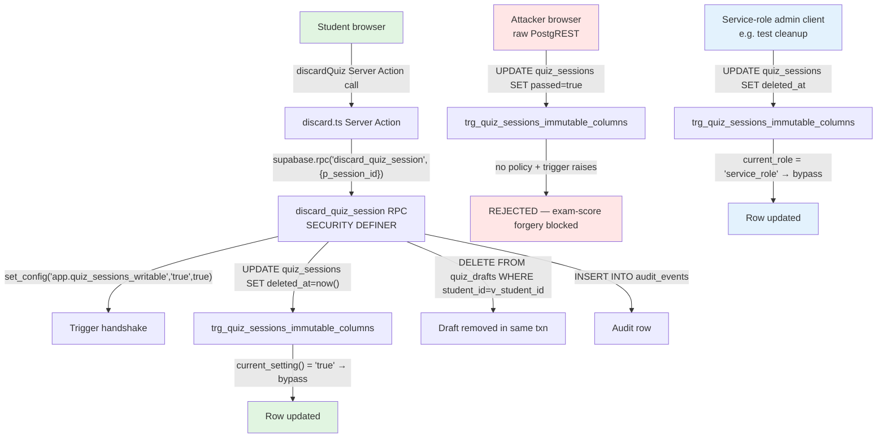

# Design Document — Quiz Sessions RPC-Only Immutability

> **STATUS: SUPERSEDED (2026-05-28).** This design was not implemented as a single migration. Several premises here no longer hold against current schema — in particular, `quiz_drafts.UNIQUE(student_id)` was dropped by migration `20260313000018_multiple_quiz_drafts.sql` (multiple drafts per student, up to 20, are now app-enforced), so the "look up draft by student_id alone" cleanup model in §"Component 3" and §"Component 4" would mis-target multi-draft cases. The remaining live work moved to the `redteam-quiz-session-bugs` spec / issue #611 (trigger column extension as mig `082`); the `discard_quiz_session` RPC + handshake design is not currently planned — `discard.ts` continues writing `quiz_sessions.deleted_at` directly under RLS. Do not use this document as the basis for new implementation work. See `tasks.md` for the full split list and replacement scope.

## Overview

This design closes red-team Vectors BL / BM / BN by collapsing the `quiz_sessions` write surface from "RLS-gated PostgREST UPDATE on owned rows" to **"SECURITY DEFINER RPC writes, period"**. After the migration lands:

- Authenticated PostgREST connections (the role used by the student JWT path) are denied UPDATE on every column of `quiz_sessions` by a combination of (a) the dropped `students_update_sessions` RLS policy and (b) the extended `trg_quiz_sessions_immutable_columns` trigger now covering all 15 columns.
- SECURITY DEFINER RPCs that legitimately update the table opt in via a transaction-local session-variable handshake (`set_config('app.quiz_sessions_writable', 'true', true)` immediately before each `UPDATE quiz_sessions ...`).
- Service-role connections (admin client used in test cleanup) retain the existing `current_role = 'service_role'` exemption — unaffected.
- A new SECURITY DEFINER RPC `discard_quiz_session(p_session_id)` replaces the direct `UPDATE quiz_sessions SET deleted_at = now() ...` write that lives in `apps/web/app/app/quiz/actions/discard.ts` today, with atomic draft cleanup folded into the same transaction.

The vector chain that exists today — student starts session → student issues `UPDATE quiz_sessions SET correct_count = 100, score_percentage = 100, passed = true, ended_at = now()` via PostgREST → session is "completed" with forged values → `batch_submit_quiz` is never invoked, exam result is forged — is broken at the trigger, before any column change is committed.

## Steering Document Alignment

### Technical Standards (tech.md)

This design directly applies the project's **"Defense in depth — proxy guard + Server Action guard + RLS + DB triggers + RPC auth checks. No layer trusts another"** principle. Specifically:

- **DB triggers**: The extended `trg_quiz_sessions_immutable_columns` trigger now covers all 15 columns and rejects any UPDATE that didn't opt-in via the session-variable handshake.
- **RPC auth checks**: The new `discard_quiz_session` RPC carries the standard `auth.uid() IS NULL → RAISE` guard, `SET search_path = public`, ownership check, and active-session check before the soft-delete write.
- **RLS** is not removed — the SELECT and INSERT policies on `quiz_sessions` remain. Only the broad authenticated UPDATE policy is dropped, since UPDATE is no longer a legitimate client operation.

The RPC follows the project's **"ACID via Postgres RPCs"** convention: the single transaction covers the session soft-delete and the optional draft hard-delete and the audit-event INSERT. No multi-step application-level transaction.

### Project Structure (structure.md)

- The new migration goes in `packages/db/migrations/080_quiz_sessions_full_immutability.sql` (numbered source-of-truth) and is mirrored to `supabase/migrations/20260505000001_quiz_sessions_full_immutability.sql`. Dual-source migration pattern is established (PR #612, mig `079` / `20260502000001`).
- The Server Action refactor stays in `apps/web/app/app/quiz/actions/discard.ts` — feature-folder co-location preserved.
- The new red-team spec goes alongside its sibling at `apps/web/e2e/redteam/quiz-session-mutable-columns.spec.ts`.

## Code Reuse Analysis

### Existing Components to Leverage

- **`trg_quiz_sessions_immutable_columns` trigger function** (`packages/db/migrations/079_quiz_sessions_immutable_columns.sql`): Extend the existing function body. Add the session-variable bypass at the top, then 5 additional `IF NEW.<col> IS DISTINCT FROM OLD.<col>` blocks for `ended_at`, `correct_count`, `score_percentage`, `passed`, `deleted_at`. Add the same 5 columns to the `BEFORE UPDATE OF` list. Re-create the trigger via `DROP TRIGGER ... ; CREATE TRIGGER ...` so the column list refresh applies cleanly.

- **`complete_empty_exam_session` RPC** (`packages/db/migrations/049_complete_empty_exam_session.sql` + revisions in `055`): The blueprint for the new `discard_quiz_session` RPC. Copy the structure: `auth.uid()` check → org lookup with `users.deleted_at IS NULL` → `FOR UPDATE` lock + ownership check → idempotent early-return → UPDATE with handshake → audit_events INSERT.

- **Audit-events INSERT pattern** (`migrations/049`, `055`, `056`, `063`): Identical column tuple — `(organization_id, actor_id, actor_role, event_type, resource_type, resource_id, metadata)`. Reuse, with `event_type = 'quiz.session_discarded'` and metadata capturing `{ mode, total_questions, draft_existed }`. The `actor_role` subquery reads from `users` and per `.claude/rules/security.md` rule 10 must include `AND deleted_at IS NULL`.

- **Server Action error-sanitization pattern** (`code-style.md` §5): Existing `discard.ts` already follows this — `console.error` server-side, generic string returned. Preserve and adapt: when the RPC raises a domain code, map to the matching message; on any other error, generic.

- **Existing red-team spec template** (`apps/web/e2e/redteam/quiz-session-config-injection.spec.ts`, PR #612): Mirror the structure exactly — `seedRedTeamUsers` + `ensureExamConfig` setup, `createAuthenticatedClient` for the attacker, `getAdminClient` for read-back and cleanup, `assertSessionStillLocked` deep-equal helper. The new spec's helper can be a separate function or, depending on plan-critic feedback, the existing `assertSessionStillLocked` could be promoted to a shared helper module covering both spec files (out of scope for this PR; flagged as a SUGGESTION in §6 unless plan-critic disagrees).

### Integration Points

- **`apps/web/app/app/quiz/actions/discard.ts`**: Refactored to a single `supabase.rpc('discard_quiz_session', { p_session_id })` call. The Zod input schema simplifies — `draftId` is no longer needed (RPC handles draft cleanup via the `UNIQUE(student_id)` constraint on `quiz_drafts`, looking up the draft by student rather than ID).
- **`apps/web/app/app/quiz/actions/discard.test.ts`**: Mock pattern shifts from the `.from().update()` chain to `.rpc()` returning `{ error }` or `{ data }`. The vi.hoisted + buildChain pattern in the project's other Server Action tests is the model.
- **`packages/db/src/types.ts`**: Regenerate via `npx supabase gen types typescript --linked` so TypeScript callers see the typed RPC signature.

## Architecture



### Modular Design Principles

- **Single File Responsibility**: The migration file `080_quiz_sessions_full_immutability.sql` does exactly one architectural thing — collapse the write surface to RPC-only — even though it touches multiple objects (trigger, policy, new RPC, four existing RPCs). Same scope-per-mig pattern as `079`.
- **Trigger function focus**: The trigger function does immutability + bypass evaluation only. No business logic, no audit emission, no derived state.
- **RPC per use case**: One RPC per legitimate write operation. `discard_quiz_session` does discard. The four existing completion RPCs each handle their own completion path. No "god RPC."
- **Server Action thin wrapper**: After refactor, `discardQuiz` is ~30 lines of orchestration: auth check, Zod parse, `.rpc()` call, error mapping, return. No DB shape knowledge bleeds into the Server Action.

## Components and Interfaces

### Component 1 — Migration `080_quiz_sessions_full_immutability.sql`

- **Purpose**: Single migration applying all schema/function changes for the RPC-only architecture.
- **Sections (in execution order)**:
  1. `DROP TRIGGER trg_quiz_sessions_immutable_columns ON quiz_sessions;` — required so the new column list can take effect.
  2. `CREATE OR REPLACE FUNCTION quiz_sessions_protect_immutable_columns()` — extended body with handshake + 5 new column checks.
  3. `CREATE TRIGGER trg_quiz_sessions_immutable_columns BEFORE UPDATE OF <15 columns> ON quiz_sessions FOR EACH ROW EXECUTE FUNCTION quiz_sessions_protect_immutable_columns();` — re-installed with full column list.
  4. `DROP POLICY students_update_sessions ON quiz_sessions;` — broad UPDATE policy removed; no replacement.
  5. `CREATE OR REPLACE FUNCTION discard_quiz_session(p_session_id uuid) RETURNS jsonb ...` — new RPC.
  6. `GRANT EXECUTE ON FUNCTION discard_quiz_session(uuid) TO authenticated;`
  7. Patch `complete_quiz_session` — `CREATE OR REPLACE FUNCTION` re-emits the function body with one new line: `PERFORM set_config('app.quiz_sessions_writable', 'true', true);` immediately before the existing `UPDATE quiz_sessions ...`.
  8. Patch `complete_empty_exam_session` — same.
  9. Patch `complete_overdue_exam_session` — same.
  10. Patch `batch_submit_quiz` — same (the function is large; patch only inserts the one line; helper grep'd to verify a single UPDATE call site).
- **Reuses**: Existing trigger pattern (mig 079), existing RPC blueprint (mig 049/055).

### Component 2 — `quiz_sessions_protect_immutable_columns()` (extended)

- **Purpose**: Single trigger function. Block authenticated-context UPDATEs on any of the 15 protected columns; bypass for service-role and for transactions that have set the handshake flag.
- **Function body (semantic shape)**:
  ```sql
  -- 1) Handshake bypass for legitimate RPC writers (LOCAL session var, txn-scoped)
  IF current_setting('app.quiz_sessions_writable', true) = 'true' THEN
    RETURN NEW;
  END IF;
  -- 2) Service-role bypass (admin client, test cleanup) — preserves existing behavior
  IF current_role = 'service_role' THEN
    RETURN NEW;
  END IF;
  -- 3) Per-column immutability checks (10 existing + 5 new)
  IF NEW.config IS DISTINCT FROM OLD.config THEN RAISE ...; END IF;
  ...
  IF NEW.ended_at IS DISTINCT FROM OLD.ended_at THEN RAISE 'Cannot modify ended_at — quiz_sessions.ended_at is RPC-only after row creation'; END IF;
  IF NEW.correct_count IS DISTINCT FROM OLD.correct_count THEN RAISE 'Cannot modify correct_count — quiz_sessions.correct_count is RPC-only after row creation'; END IF;
  IF NEW.score_percentage IS DISTINCT FROM OLD.score_percentage THEN RAISE 'Cannot modify score_percentage — quiz_sessions.score_percentage is RPC-only after row creation'; END IF;
  IF NEW.passed IS DISTINCT FROM OLD.passed THEN RAISE 'Cannot modify passed — quiz_sessions.passed is RPC-only after row creation'; END IF;
  IF NEW.deleted_at IS DISTINCT FROM OLD.deleted_at THEN RAISE 'Cannot modify deleted_at — quiz_sessions.deleted_at is RPC-only after row creation'; END IF;
  RETURN NEW;
  ```
- **Interfaces**: Trigger entry point — implicit (Postgres invokes via the `BEFORE UPDATE OF` declaration).
- **Dependencies**: PostgreSQL `current_setting()` and `current_role` built-ins. No application dependencies.
- **Reuses**: Existing trigger function body. Extension preserves all 10 prior column checks verbatim.

### Component 3 — `discard_quiz_session(p_session_id uuid)` RPC

- **Purpose**: Atomic discard of an active quiz session owned by the calling student. Soft-deletes the session, hard-deletes any draft for this student, emits an audit event.
- **Signature**:
  ```sql
  CREATE OR REPLACE FUNCTION discard_quiz_session(p_session_id uuid)
  RETURNS jsonb
  LANGUAGE plpgsql
  SECURITY DEFINER
  SET search_path = public
  ```
- **Returns**: `jsonb` shape `{ session_id: uuid, draft_existed: boolean, already_discarded: boolean }`. The third field supports idempotency reporting back to the Server Action without raising.
- **Body sequence**:
  1. `v_student_id := auth.uid();` — `IF NULL RAISE 'not_authenticated';`
  2. Lookup `users.organization_id` for `v_student_id` `WHERE deleted_at IS NULL` — `IF NULL RAISE 'user_not_found_or_inactive';`
  3. `SELECT ... INTO v_ended_at, v_mode, v_deleted_at FROM quiz_sessions WHERE id = p_session_id AND student_id = v_student_id AND organization_id = v_org_id FOR UPDATE;` — `IF NOT FOUND RAISE 'not_authorized';` (we do NOT filter `deleted_at IS NULL` here — we want to detect the already-discarded case for idempotent return).
  4. `IF v_deleted_at IS NOT NULL THEN RETURN jsonb_build_object('session_id', p_session_id, 'draft_existed', false, 'already_discarded', true);` — idempotent.
  5. `IF v_ended_at IS NOT NULL THEN RAISE 'session_already_ended';`
  6. `IF v_mode = 'internal_exam' THEN RAISE 'internal_exam_not_discardable';`
  7. `PERFORM set_config('app.quiz_sessions_writable', 'true', true);`
  8. `UPDATE quiz_sessions SET deleted_at = now() WHERE id = p_session_id;`
  9. `DELETE FROM quiz_drafts WHERE student_id = v_student_id RETURNING id INTO v_draft_id;` — `v_draft_existed := v_draft_id IS NOT NULL;`. (`UNIQUE(student_id)` guarantees at most one row.)
  10. `INSERT INTO audit_events (..., 'quiz.session_discarded', ..., metadata := jsonb_build_object('mode', v_mode, 'draft_existed', v_draft_existed));`. The `actor_role` subquery filters `WHERE id = v_student_id AND deleted_at IS NULL` per `.claude/rules/security.md` rule 10.
  11. `RETURN jsonb_build_object('session_id', p_session_id, 'draft_existed', v_draft_existed, 'already_discarded', false);`
- **Interfaces**: PostgREST RPC, callable by `authenticated` role.
- **Dependencies**: `quiz_sessions`, `quiz_drafts`, `audit_events`, `users`. The handshake mechanism on `quiz_sessions`.
- **Reuses**: `complete_empty_exam_session` body skeleton (mig 049 + 055). Audit-event INSERT pattern (any of the recent completion RPCs).

### Component 4 — Server Action `discardQuiz` refactor

- **Purpose**: Thin wrapper around the RPC. Parse input, auth-check (defense in depth — RPC also checks), call RPC, map errors, return.
- **Interfaces**: Server Action signature unchanged from caller perspective: `discardQuiz(raw: unknown): Promise<{ success: true } | { success: false; error: string }>`.
- **Input schema simplifies**: `z.object({ sessionId: z.uuid() })` — `draftId` removed since the RPC handles draft cleanup via the student's UNIQUE constraint.
- **Error mapping** (exact strings preserved where the UI/tests already assert them):
  | RPC raise | Server Action error string |
  |---|---|
  | `not_authenticated` | `'Not authenticated'` |
  | `not_authorized` | `'Session not found or already discarded'` |
  | `session_already_ended` | `'Session not found or already discarded'` |
  | `internal_exam_not_discardable` | `'cannot_discard_internal_exam'` (preserves existing error code asserted by callers) |
  | `user_not_found_or_inactive` | `'Failed to discard quiz'` (treated as generic error; rare) |
  | any other | `'Failed to discard quiz'` (with `console.error` log) |
- **Reuses**: Existing auth-check + Zod parse + try/catch wrapper from current `discard.ts`.

### Component 5 — Patches to four existing completion RPCs

- **Purpose**: Add the handshake (`PERFORM set_config('app.quiz_sessions_writable', 'true', true);`) immediately before each `UPDATE quiz_sessions ...` statement, so the new trigger lets them through.
- **Files affected** (via `CREATE OR REPLACE FUNCTION` in the same migration file):
  - `complete_quiz_session` — find via `grep` against the latest definition; mig where last redefined cited inline in the new mig comment.
  - `complete_empty_exam_session` — last redefined in mig `055`.
  - `complete_overdue_exam_session` — last redefined in mig `063`.
  - `batch_submit_quiz` — last redefined in mig `078` (active-user gate); the UPDATE call site is the completion-write path, single occurrence per current grep.
- **Constraints**: For each, copy the current latest body verbatim, insert the one-line handshake, no other changes. Because each function is `CREATE OR REPLACE`, the recreation is idempotent. Plan-critic should verify the body copy is faithful by diff.

### Component 6 — Red-team spec

- **Purpose**: Three attack tests proving the database rejects forgery attempts.
- **Structure** (mirrors `quiz-session-config-injection.spec.ts`):
  - `test.describe('Vector BL/BM/BN — quiz_sessions mutable columns ...')`
  - `beforeEach` — fresh attacker client, fresh active session via legitimate flow, capture original frozen snapshot via admin client.
  - `test('Attack BL — student forges correct_count + ended_at')` — direct UPDATE → assert error (RLS or trigger) → assert session row deep-equal to original via admin client.
  - `test('Attack BM — student forges passed = true')` — same shape.
  - `test('Attack BN — student forges score_percentage = 100')` — same shape.
  - `afterEach` — admin client cleanup of test session.

## Data Models

No new tables. No schema changes other than the trigger column-list extension. The audit_events table gets a new `event_type` value (`'quiz.session_discarded'`) but no schema change — the column is text without enum constraint.

### `quiz_sessions` (existing, unchanged columns)
- 15 of 15 columns frozen post-migration. Mutable from RPC handshake context only.

### `audit_events` (new event_type)
- `event_type`: `'quiz.session_discarded'`
- `resource_type`: `'quiz_session'`
- `resource_id`: the session uuid
- `metadata`: `{ mode: 'study'|'mock_exam'|'internal_exam'|..., draft_existed: boolean }` (no PII, no scores)

## Error Handling

### Error Scenarios

1. **Vector BL/BM/BN — student forges columns directly via PostgREST**
   - **Handling**: Trigger raises `Cannot modify <col> — quiz_sessions.<col> is RPC-only after row creation`. RLS layer also rejects (no UPDATE policy for `authenticated` after the DROP).
   - **User Impact**: Not user-facing. Direct API misuse only. The legitimate UI never issues this UPDATE.

2. **Student calls `discardQuiz` for a session they don't own**
   - **Handling**: RPC raises `not_authorized` (after `FOR UPDATE` selects find no row matching `student_id = v_student_id`).
   - **User Impact**: `'Session not found or already discarded'`.

3. **Student calls `discardQuiz` for a session that is internal_exam**
   - **Handling**: RPC raises `internal_exam_not_discardable`.
   - **User Impact**: `'cannot_discard_internal_exam'` (preserves the exact error code asserted in existing tests/UI).

4. **Student calls `discardQuiz` for an already-discarded session**
   - **Handling**: RPC returns `{ already_discarded: true }` — no raise. Server Action treats success identically.
   - **User Impact**: User sees the discard succeed; idempotent UX.

5. **Student calls `discardQuiz` for a completed (ended_at IS NOT NULL) session**
   - **Handling**: RPC raises `session_already_ended`. Maps to `'Session not found or already discarded'`.
   - **User Impact**: Same string as the non-ownership case — does not leak the difference to the caller (avoids enumeration via error messages).

6. **Developer adds a new RPC writing `quiz_sessions` and forgets the handshake**
   - **Handling**: At first runtime call, the `UPDATE` raises `Cannot modify <col> — quiz_sessions.<col> is RPC-only after row creation`. Loud failure, not silent corruption.
   - **User Impact**: That specific RPC's flow fails until handshake is added. Caught in dev/CI; never reaches prod if integration tests cover the path.

## Testing Strategy

### Unit Testing

- **Server Action — `apps/web/app/app/quiz/actions/discard.test.ts`**: Update mocks. The `vi.hoisted` + `buildChain` pattern used in sibling `actions/*.test.ts` files. Test cases:
  1. Auth failure → returns `'Not authenticated'`.
  2. Zod parse failure → returns `'Invalid input'`.
  3. RPC success (`{ already_discarded: false, draft_existed: false }`) → returns `{ success: true }`.
  4. RPC success (`{ already_discarded: true }`) → returns `{ success: true }` (idempotent).
  5. RPC raises `internal_exam_not_discardable` → returns `'cannot_discard_internal_exam'`.
  6. RPC raises `not_authorized` → returns `'Session not found or already discarded'`.
  7. RPC raises generic error → returns `'Failed to discard quiz'` + `console.error` called.

### Integration Testing

- The RPC itself is exercised via the red-team spec (Playwright with real DB). No additional Vitest integration tests needed — Playwright covers the full DB stack.
- Existing integration tests for `complete_quiz_session`, `complete_empty_exam_session`, `complete_overdue_exam_session`, `batch_submit_quiz` (Playwright e2e + supabase-integration) must still pass after the handshake patch — the post-commit `pnpm test` and `pnpm --filter @repo/web e2e` runs are the verification.

### End-to-End Testing

- **New red-team spec** `apps/web/e2e/redteam/quiz-session-mutable-columns.spec.ts` — three attack cases (BL / BM / BN). Run via `pnpm --filter @repo/web e2e:redteam` and via the `redteam.yml` CI workflow.
- **Existing red-team spec** `apps/web/e2e/redteam/quiz-session-config-injection.spec.ts` (Vector AM) — must continue to pass. The trigger function body change must not regress the original 10-column coverage. The `assertSessionStillLocked` helper there does deep-equal on all 10 columns and will catch any narrowing.
- **Existing exam/quiz E2E specs** — must continue to pass. The legitimate completion paths (auto-submit, manual submit, overdue completion) all go through the four patched RPCs; tests verify the handshake patch doesn't break them.
- **Existing discard E2E test** (`apps/web/app/app/quiz/actions/discard.test.ts` is the unit, but if there's a Playwright equivalent for the discard flow, it must continue to pass).
