# Design Document

## Overview

This spec implements six improvements to the LMS Plus v2 orchestrator workflow, shifting quality checks upstream and adding structure to planning, delegation, and session continuity. The changes are entirely internal -- they modify agent rules (`.claude/rules/`), agent definitions (`.claude/agents/`), and workflow documentation. No production code, database schema, UI, or CI/CD pipelines are affected.

The six requirements:

| ID | Name | Priority | Summary |
|----|------|----------|---------|
| R1 | Evaluator-Optimizer Loop | CRITICAL | Pre-commit critic agents review plans and code before commit |
| R2 | Formal Spec Artifacts | HIGH | Persist plans as structured specs via spec-workflow MCP |
| R3 | Interview Phase | MEDIUM | Surface requirement ambiguities before implementation |
| R4 | Task Persistence | MEDIUM | Track multi-step work across session restarts |
| R5 | Delegation Protocol | MEDIUM | Standardized 5-section template for all subagent prompts |
| R6 | Steering Doc Drift Detection | LOW-MEDIUM | Doc-updater compares diffs against steering docs |

All six are additive -- no existing workflow steps are removed or replaced. New steps slot into the existing 9-step pipeline documented in `CLAUDE.md`.

## Steering Document Alignment

### Technical Standards (tech.md)

- **No new dependencies**: All changes use existing tools (Agent tool, spec-workflow MCP, TaskCreate/TaskUpdate). No npm packages, no new MCP servers.
- **No production code changes**: Changes are confined to `.claude/`, `.spec-workflow/`, and `docs/` directories, consistent with the "workflow and tooling only" constraint in tech.md.
- **Agent model assignments**: Plan-critic and implementation-critic use Sonnet, matching the precedent set by semantic-reviewer and test-writer for logic-heavy review tasks. No Haiku agents are added (critics need deep reasoning).
- **Conventional Commits**: All commits from this spec use `chore:` or `docs:` prefixes since no production code changes.

### Project Structure (structure.md)

- **Agent definitions**: New files follow the existing pattern in `.claude/agents/` -- YAML frontmatter (name, description, model) followed by markdown with mission, inputs, checks, output format, DO NOT, and memory sections. See `.claude/agents/code-reviewer.md` as the template.
- **Agent rules**: New files follow the existing pattern in `.claude/rules/` -- header with model/trigger/blocking info, Purpose section, Severity table, DO/NEVER sections. See `.claude/rules/agent-semantic-reviewer.md` as the template.
- **No barrel files, no new directories**: All new files go into existing directories (`.claude/agents/`, `.claude/rules/`).

## Code Reuse Analysis

### Existing Components to Leverage

- **`agent-workflow.md` pipeline structure**: The existing plan validation pipeline (explore -> root cause -> draft -> validate -> approve -> execute) is the insertion point for R1 (critics), R3 (interview), and R5 (delegation). The pipeline diagram and step table format are reused.
- **Severity level system**: The existing CRITICAL/ISSUE/SUGGESTION/GOOD levels from `agent-semantic-reviewer.md` are reused for critic agents (R1). No new severity terminology introduced (per NFR Usability requirement 4).
- **Finding Validation protocol**: The existing "finding -> validate -> fix -> re-validate" loop in `agent-workflow.md` applies to critic findings too. No duplicate validation protocol needed.
- **Agent definition format**: `.claude/agents/code-reviewer.md` provides the proven structure (frontmatter, mission, inputs, checks, output format, suppressions, memory). Both new agent definitions (plan-critic, implementation-critic) follow this format exactly.
- **DO/NEVER pattern**: Every existing rule file uses DO/NEVER sections. All new rule content follows this convention.

### Integration Points

- **Agent tool**: Critics run as in-session subagents via the Agent tool, same as post-commit agents. No new invocation mechanism.
- **Spec-workflow MCP**: Already installed. R2 documents when to use it; no MCP configuration changes needed.
- **TaskCreate/TaskUpdate**: Already available as deferred tools. R4 documents when to use them; no tool changes needed.
- **Doc-updater agent**: R6 extends the existing doc-updater with a new check (steering drift). The agent definition and rule file both get new sections.

## Architecture

### Modular Design Principles

- **Single File Responsibility**: Each agent has exactly one definition file (`.claude/agents/*.md`) and one rule file (`.claude/rules/agent-*.md`). Critics get both; the delegation protocol and interview phase live in `agent-workflow.md` because they are orchestrator behaviors, not agent behaviors.
- **Additive integration**: New steps insert into the existing pipeline at well-defined points. The pipeline remains a single linear flow with conditional branches, not a parallel or competing workflow.
- **Graceful degradation**: Every new step has a skip/fallback path. Agent timeout -> proceed with warning. MCP unavailable -> manual file creation. TaskCreate unavailable -> session summary tracking.

### Updated Workflow Pipeline

The following diagram shows the complete orchestrator pipeline after all six requirements are implemented. New steps are marked with their requirement ID.

```mermaid
flowchart TD
    A[User request] --> B[Explore - subagents map relevant code]
    B --> C[Root cause check]
    C --> D{Multi-file change?}
    
    D -->|Yes, 3+ files| S[Create spec via MCP - R2]
    D -->|Yes, < 3 files| I
    D -->|No, single-file| SKIP_I[Skip to Draft plan]
    S --> I
    
    I[Interview phase - R3] --> I_Q{Ambiguities found?}
    I_Q -->|Yes| I_ASK[Present clarifying questions]
    I_Q -->|No / skipped / bug fix| I_DONE[Proceed]
    I_ASK --> I_ANS[User answers incorporated into plan]
    I_ANS --> I_DONE
    
    SKIP_I --> DRAFT
    I_DONE --> DRAFT[Draft plan]
    
    DRAFT --> VAL[Plan validation - impact, contracts, patterns, docs, security]
    
    VAL --> PC{Plan-critic - R1}
    PC -->|ISSUE/CRITICAL| PC_REV[Revise plan - max 1 round]
    PC -->|Clean / SUGGESTION only| UA
    PC_REV --> PC_RE[Re-submit to plan-critic]
    PC_RE --> UA
    
    UA[User approves]
    UA --> EX[Execute - subagents implement]
    
    EX --> IC{Implementation-critic - R1}
    IC -->|ISSUE| IC_REV[Implementing agent revises - max 2 rounds]
    IC -->|CRITICAL| IC_ORCH[Orchestrator intervenes directly]
    IC -->|Clean| COMMIT
    IC_REV --> IC_RE{Re-submit to critic}
    IC_RE -->|Still has issues, round 2| IC_ORCH
    IC_RE -->|Clean| COMMIT
    IC_ORCH --> COMMIT
    
    COMMIT[git commit]
    COMMIT --> POST[Post-commit agents - 4 in parallel]
    POST --> READ[Read ALL results]
    READ --> FIX[Validate findings, fix issues]
    FIX --> LEARN[Learner agent]
    LEARN --> TASK[Update task status - R4]
    
    TASK --> PUSH_CHECK{Multi-commit PR?}
    PUSH_CHECK -->|Yes| PR_SWEEP[PR-level semantic review]
    PUSH_CHECK -->|No| DONE[Done]
    PR_SWEEP --> DONE

    style S fill:#e6f3ff,stroke:#4a90d9
    style I fill:#e6f3ff,stroke:#4a90d9
    style I_ASK fill:#e6f3ff,stroke:#4a90d9
    style I_ANS fill:#e6f3ff,stroke:#4a90d9
    style PC fill:#fff3e6,stroke:#d9944a
    style PC_REV fill:#fff3e6,stroke:#d9944a
    style PC_RE fill:#fff3e6,stroke:#d9944a
    style IC fill:#fff3e6,stroke:#d9944a
    style IC_REV fill:#fff3e6,stroke:#d9944a
    style IC_RE fill:#fff3e6,stroke:#d9944a
    style IC_ORCH fill:#fff3e6,stroke:#d9944a
    style TASK fill:#e6ffe6,stroke:#4ad94a
```



## Components and Interfaces

### R1: Evaluator-Optimizer Loop

#### New file: `.claude/agents/plan-critic.md`

- **Purpose**: Reviews validated plans against the codebase before execution begins. Catches wrong assumptions, missed callers, incorrect fallback values, and pattern violations that plan validation might miss.
- **Model**: Sonnet (logic-heavy review requires deep reasoning)
- **Trigger**: Orchestrator invokes via Agent tool after plan validation, before user approval
- **Inputs**: The validated plan text, plus the source files listed in the plan's "Files to change" and "Files affected" sections
- **Output format**: Findings list using CRITICAL/ISSUE/SUGGESTION/GOOD severity levels (same as semantic-reviewer)
- **Revision cap**: 1 round. If the revised plan still has ISSUE/CRITICAL findings after one revision, the orchestrator resolves directly.
- **Skip condition**: Single-file changes under 10 lines

```
PLAN-CRITIC REVIEW — [timestamp]

CRITICAL: [count]
ISSUE: [count]
SUGGESTION: [count]

--- FINDINGS ---

[ISSUE] Plan step 3 assumes `getQuestions()` returns `{ data, error }` but the function
actually returns `{ questions, hasMore }`. The plan's error handling will never trigger.
Affected: apps/web/lib/queries/questions.ts (line ~42)
Suggestion: Update plan to destructure `{ questions, hasMore }` and handle empty array case.

--- VERDICT ---
[N] issues require plan revision before execution.
```

#### New file: `.claude/agents/implementation-critic.md`

- **Purpose**: Reviews staged changes (pre-commit) against the validated plan and requirements. Catches logic errors, missed requirements, and deviations from the approved plan.
- **Model**: Sonnet
- **Trigger**: Orchestrator invokes via Agent tool after subagent implementation, before `git commit`
- **Inputs**: `git diff --staged`, the validated plan, and the requirements (from spec if one exists, or from the plan output)
- **Output format**: Same CRITICAL/ISSUE/SUGGESTION/GOOD severity levels
- **Revision flow**: ISSUE -> implementing agent revises. CRITICAL -> orchestrator intervenes. Max 2 revision rounds between critic and implementer, then orchestrator takes over.
- **Skip condition**: None. Even single-file changes get implementation review (the plan-critic is what gets skipped for small changes, not the implementation-critic).

```
IMPLEMENTATION REVIEW — [timestamp]
Plan: [brief plan reference]
Files reviewed: [N]

CRITICAL: [count]
ISSUE: [count]
SUGGESTION: [count]

--- FINDINGS ---

[ISSUE] Plan specified `?? total` as fallback but implementation uses `?? 0` at line 47.
File: apps/web/lib/queries/progress.ts
Suggestion: Change fallback to `total` to match plan. If `0` is intentional, update the plan.

--- VERDICT ---
[Clean / N issues require revision]
```

#### New file: `.claude/rules/agent-critic.md`

- **Purpose**: Handling rules for both plan-critic and implementation-critic findings. Covers severity definitions, revision caps, escalation paths, and orchestrator behavior.
- **Dependencies**: References `agent-semantic-reviewer.md` severity levels (reuses, does not redefine)
- **Key rules**:
  - Plan-critic findings at ISSUE/CRITICAL block execution until resolved
  - Implementation-critic findings at ISSUE trigger implementer revision (max 2 rounds)
  - Implementation-critic CRITICAL triggers immediate orchestrator intervention
  - After 2 unsuccessful revision rounds, orchestrator resolves directly (no infinite loops)
  - SUGGESTION findings are noted but do not block
  - Single-file changes under 10 lines skip plan-critic; implementation-critic still runs
  - Pre-commit critics do NOT replace post-commit agents (additive only)

#### Modified file: `.claude/rules/agent-workflow.md`

- **What changes**: Two new sections inserted into the Plan Validation Pipeline:
  1. "Plan-Critic Review" section between "Validated plan" and "User approves" in the pipeline diagram and narrative
  2. "Pre-Commit Implementation Review" section between "Execute" and "git commit" in the Post-Implementation Pipeline
- **Pipeline diagram update**: Add plan-critic and implementation-critic steps with revision loops
- **DO/NEVER updates**: Add entries for critic handling (e.g., "DO: Run plan-critic on every multi-file plan", "NEVER: Skip implementation-critic, even for small changes")

### R2: Formal Spec Artifacts

#### Modified file: `.claude/rules/agent-workflow.md`

- **What changes**: New section "Spec Artifact Rules" added after the Plan Validation Pipeline section
- **Content**:
  - **When to create a spec**: Features spanning 3+ files OR introducing a new architectural pattern. Created via spec-workflow MCP tools (`mcp__spec-workflow__*`).
  - **When NOT to create a spec**: Bug fixes, single-file refactors, changes under 3 files. The existing plan validation pipeline in `agent-workflow.md` is sufficient.
  - **Spec lifecycle**: Created during planning -> updated during implementation -> committed with feature branch -> serves as session resume context.
  - **Spec-as-context rule**: When a spec exists, the orchestrator references it (not chat history) as the source of truth for requirements and plan.
  - **Deviation rule**: After a spec reaches "approved" status, material approach changes require updating the spec and noting the deviation.
  - **MCP fallback**: If spec-workflow MCP is unavailable, write spec files manually to `.spec-workflow/specs/<name>/` using the template structure.

### R3: Interview Phase

#### Modified file: `.claude/rules/agent-workflow.md`

- **What changes**: New step "Requirement Interview" inserted into the Plan Validation Pipeline between "Root cause check" and "Draft plan"
- **Pipeline position**: After the orchestrator has explored the code and checked root cause, but before drafting the plan. This ensures the orchestrator has enough context to ask meaningful questions.
- **Content**:

  **Interview template** (3-5 questions covering):
  1. **Scope boundaries**: "Is X in scope or out of scope for this change?"
  2. **Behavioral ambiguities**: "When Y happens, should the system do A or B?"
  3. **Priority trade-offs**: "The full solution involves X, Y, Z. Are all must-have, or can Z be deferred?"

  **Auto-skip conditions** (interview is skipped when ANY of these apply):
  - Single-file bug fix with clear reproduction path and single root cause
  - User explicitly says "skip interview" or "no questions needed"
  - Orchestrator identifies zero ambiguities after root cause analysis (must state "No ambiguities identified" and proceed)

  **Answer incorporation**: Answers feed into the plan draft. If a spec exists (R2), answers are recorded in the spec's requirements section.

  **Default behavior**: Interview is on by default for multi-file changes. Skippable but not skipped silently -- the orchestrator either asks questions or explicitly states no ambiguities.

### R4: Task Persistence

#### Modified file: `.claude/rules/agent-workflow.md`

- **What changes**: New section "Task Persistence" added after the Orchestrator Role section
- **Content**:

  **When to create tasks**: Features with 5+ discrete implementation steps. The orchestrator uses `TaskCreate` for each step.

  **Task lifecycle**:
  - `pending` -- created during planning
  - `in_progress` -- set via `TaskUpdate` when work on that step begins
  - `completed` -- set via `TaskUpdate` when the step passes review

  **Session resume protocol**: When a new session begins and the developer asks to resume work, the orchestrator runs `TaskList` before exploring the codebase. Outstanding tasks provide the starting context.

  **Completion reporting**: When all tasks for a feature are `completed`, the orchestrator reports a summary to the developer.

  **Threshold**: Below 5 steps, task creation is optional (orchestrator's discretion).

  **Fallback**: If `TaskCreate`/`TaskUpdate` are unavailable, fall back to tracking tasks in the session summary.

### R5: Standardized Delegation Protocol

#### Modified file: `.claude/rules/agent-workflow.md`

- **What changes**: New section "Delegation Protocol" added after the "Proactive Engineering Guidance" section
- **Content**:

  **Template** (5 required sections for every subagent prompt):

  ```
  ## TASK
  [What to do -- specific action verb + scope]

  ## OBJECTIVE
  [Why it matters -- connects to the user's goal or a specific requirement]

  ## DONE WHEN
  [Measurable exit criteria -- what the orchestrator checks on return]

  ## CONSTRAINTS
  [What NOT to do -- file boundaries, line limits, security rules, scope limits]
  [For post-commit agents: reference the agent definition file as the primary constraint source]

  ## CONTEXT
  [Relevant file paths, type signatures, patterns to follow, related test files]
  [Must be self-contained -- no dependencies on sibling agent outputs]
  ```

  **Litmus test**: Before dispatching any subagent, the orchestrator asks: "Could this agent execute end-to-end without a follow-up question?" If no, add the missing context.

  **Parallel dispatch rule**: When multiple subagents launch in parallel, each prompt is self-contained. No prompt depends on a sibling agent's output from the same batch.

  **Failure logging**: If a subagent returns a result indicating it lacked context (e.g., "file not found", "unclear which pattern"), the orchestrator logs it as a delegation failure and improves future prompts for that agent type. Log format:

  ```
  DELEGATION FAILURE — [agent type] — [timestamp]
  Missing: [what the agent needed but didn't have]
  Fix: [what to include next time]
  ```

  **Post-commit agent integration**: For post-commit agents (code-reviewer, semantic-reviewer, doc-updater, test-writer), the existing agent definition files serve as the CONSTRAINTS and CONTEXT sections. The delegation template supplements (TASK, OBJECTIVE, DONE WHEN) but does not duplicate the definitions.

### R6: Steering Document Drift Detection

#### Modified file: `.claude/rules/agent-doc-updater.md`

- **What changes**: New section "Steering Document Drift Detection" added after the "File Rename Protocol" section
- **Content**:

  **New finding type**: DRIFT (non-blocking, reported to orchestrator for decision)

  **Severity escalation**: If drift contradicts `docs/security.md` or `.claude/rules/security.md`, the finding is elevated to CRITICAL (per NFR Security requirement 2).

  **What the agent checks**: After running its normal doc sync checks, the doc-updater compares the commit diff against each file in `.spec-workflow/steering/` (`product.md`, `tech.md`, `structure.md`). It looks for:
  - Code that contradicts a statement in a steering doc (e.g., tech.md says "Server Actions only for mutations" but the diff adds a mutation route handler)
  - New patterns not documented in steering docs (e.g., a new storage integration not mentioned in tech.md)

  **What the agent does NOT do**: Edit steering docs. Steering docs require explicit developer approval to change. The agent reports drift; the orchestrator surfaces it to the developer.

  **Orchestrator decision tree**:
  - Drift is intentional (code is correct, steering doc is outdated) -> update steering doc via spec-workflow MCP approval process
  - Drift is unintentional (steering doc is correct, code is wrong) -> treat as ISSUE, fix code in same session

  **Skip condition**: If `.spec-workflow/steering/` does not exist or contains no files, the drift detection step is skipped without error.

#### Modified file: `.claude/agents/doc-updater.md`

- **What changes**: New check added to the agent's review checklist
- **Content**: After the existing doc sync checks, the agent adds a steering drift check:
  1. Read each file in `.spec-workflow/steering/` (if the directory exists)
  2. Compare the commit diff against statements in each steering doc
  3. Report any contradictions as DRIFT findings with: the specific steering doc and section, the contradicting code (file + line), and a suggested resolution (update doc or fix code)

#### New row in doc-updater Key Documents table:

| Document | What triggers an update |
|----------|------------------------|
| `.spec-workflow/steering/*.md` | Code change contradicts a steering doc statement (DRIFT finding, not an update -- doc-updater reports only) |

## Data Models

No database tables, RPCs, or persistent data structures are introduced. The "data" in this spec consists of:

### Delegation Template Structure

Used by the orchestrator when constructing subagent prompts (R5). Not a stored data model -- it is a markdown template embedded in `agent-workflow.md`.

```
Fields:
  - TASK: string (action verb + scope)
  - OBJECTIVE: string (why it matters)
  - DONE WHEN: string[] (measurable exit criteria)
  - CONSTRAINTS: string[] (boundaries, limits, security rules)
  - CONTEXT: string[] (file paths, types, patterns)
```

### Critic Finding Structure

Output format for plan-critic and implementation-critic agents (R1). Not a stored model -- it is the markdown output format defined in agent definition files.

```
Fields:
  - severity: CRITICAL | ISSUE | SUGGESTION | GOOD
  - location: string (file path + line number, or plan step reference)
  - description: string (what is wrong)
  - suggestion: string (how to fix)
```

### Delegation Failure Log Entry

Logged by the orchestrator when a subagent indicates missing context (R5). Appended to agent memory or session notes.

```
Fields:
  - agent_type: string (explore | implement | review | test)
  - timestamp: ISO 8601
  - missing: string (what the agent needed)
  - fix: string (what to include next time)
```

## Error Handling

### Error Scenarios

1. **Plan-critic agent times out (over 60s for 10 or fewer files, over 120s for more than 10 files)**
   - **Handling**: Orchestrator proceeds with a warning to the developer. The plan-critic step is recorded as "timed out" in the session log. Post-commit agents still run as the safety net.
   - **User impact**: Developer is warned that pre-commit plan review was skipped. No workflow blockage.

2. **Implementation-critic agent times out (over 90s for under 500 line diff)**
   - **Handling**: Same as plan-critic timeout -- proceed with warning. Post-commit agents catch what the critic missed.
   - **User impact**: Developer is warned. Commit proceeds.

3. **Implementation-critic and implementer fail to converge after 2 rounds**
   - **Handling**: Orchestrator takes over resolution directly (per R1 acceptance criterion 6). The orchestrator reads the critic's findings, reads the code, and makes the fix itself.
   - **User impact**: Slight delay while orchestrator resolves, but no infinite loop. Maximum pre-commit overhead stays within the 5-minute budget.

4. **Spec-workflow MCP is unavailable (server not running)**
   - **Handling**: Orchestrator falls back to writing spec files manually using the existing template structure in `.spec-workflow/templates/`. A warning is logged.
   - **User impact**: Specs are still created, just without MCP validation and status tracking.

5. **TaskCreate/TaskUpdate tools are unavailable**
   - **Handling**: Orchestrator falls back to tracking tasks in the session summary text. A warning is logged.
   - **User impact**: Tasks are tracked conversationally rather than persistently. Session resume requires re-reading chat history.

6. **Steering docs directory does not exist**
   - **Handling**: Doc-updater's drift detection step is skipped silently (no error, no warning). This is expected for repos that haven't set up steering docs yet.
   - **User impact**: None.

7. **Steering drift contradicts security rules**
   - **Handling**: Elevated from DRIFT to CRITICAL severity. Orchestrator surfaces immediately. If drift is unintentional, code is fixed in the same session (treated as ISSUE).
   - **User impact**: Same as any CRITICAL finding -- work stops until resolved.

8. **Developer says "skip" for interview/plan-critic/spec creation**
   - **Handling**: The step is skipped. The orchestrator notes the skip in the session log but does not argue or re-prompt.
   - **User impact**: Faster workflow, with the trade-off of potentially missing ambiguities or plan issues. Post-commit agents remain as the safety net.

## Testing Strategy

This spec modifies only markdown rule and agent definition files. There is no TypeScript code to unit test. Testing focuses on verifying that the new workflow steps integrate correctly and produce the expected behavior.

### Unit Testing

Not applicable in the traditional sense (no functions to test). The equivalent is:

- **Agent definition syntax**: Each new agent file (`.claude/agents/plan-critic.md`, `.claude/agents/implementation-critic.md`) is validated by running the agent on a sample plan/diff and confirming it produces output in the expected format.
- **Rule file completeness**: Each new rule file (`.claude/rules/agent-critic.md`) is reviewed to confirm it has all required sections: header, Purpose, Severity Levels, DO, NEVER.

### Integration Testing

- **Pipeline flow test**: After all files are committed, the orchestrator runs through a multi-file change end-to-end using the updated pipeline. This verifies that:
  - The interview phase triggers for multi-file changes and skips for single-file bug fixes
  - The plan-critic runs after validation and before user approval
  - The implementation-critic runs after execution and before commit
  - The delegation protocol template is used for all subagent prompts
  - The doc-updater checks steering docs for drift
  - Task persistence tracks steps correctly

- **Skip path test**: The orchestrator runs through a single-file, under-10-line change to verify:
  - Interview is skipped
  - Plan-critic is skipped
  - Spec creation is skipped
  - Implementation-critic still runs
  - Post-commit agents still run

### End-to-End Testing

- **Session resume test**: Create tasks for a multi-step feature, end the session, start a new session, and verify that `TaskList` provides the correct resume context.
- **Drift detection test**: Make a code change that contradicts a steering doc statement, commit it, and verify the doc-updater reports a DRIFT finding with the correct reference.
- **Critic revision loop test**: Submit a plan with an intentional error, verify the plan-critic catches it, revise, and confirm the revised plan passes. Then submit code with an intentional deviation from the plan, verify the implementation-critic catches it, and confirm the revision flow respects the 2-round cap.

All integration and E2E testing is manual (orchestrator-driven) since the artifacts are markdown files consumed by AI agents, not executable code.

---

## Summary of File Changes

| File | Action | Requirement |
|------|--------|-------------|
| `.claude/agents/plan-critic.md` | CREATE | R1 |
| `.claude/agents/implementation-critic.md` | CREATE | R1 |
| `.claude/rules/agent-critic.md` | CREATE | R1 |
| `.claude/rules/agent-workflow.md` | MODIFY (add 5 sections) | R1, R2, R3, R4, R5 |
| `.claude/rules/agent-doc-updater.md` | MODIFY (add drift section) | R6 |
| `.claude/agents/doc-updater.md` | MODIFY (add steering check) | R6 |
| `CLAUDE.md` | MODIFY (update 9-step pipeline to reflect new steps) | R1, R2, R3 |

Total: 3 new files, 4 modified files. All in `.claude/` directory. Zero production code changes.

---

*Last updated: 2026-04-03*
